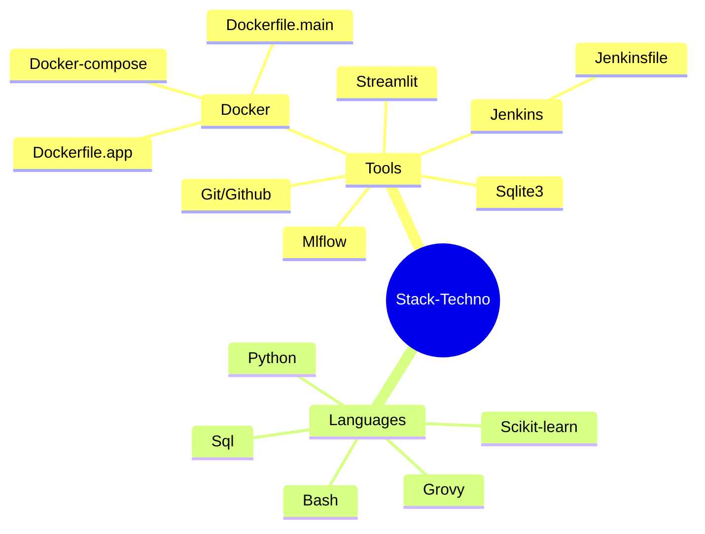

## Ce **POC** a pour objectif de lancer une architecture Générative AI capable d'analyser ou travailler sur un **moteurs d'octroi** et **fragilité bancaire.** Ainsi, elle doit avoir une approche **conceptuel/démonstractif** et **technique avec codes et données factices**.

## 1 - Moteurs d'octroi :

### a. Objectif : 
> Simuler ou analyser l'octroi de crédit ou de produits financiers via des modéles intelligents. 

### b. Idée du POC GenAI :
- **Entrées :** données clients (profils, historique de paiement, revenu, etc...)
- **GenAI :** propose un scoring de risque ou des recommendations pour l'octroi 
- **Sorties :** décision "Accordé/Réfusé/Besoin d'info complémentaire" + explication synthétique par l'IA 
- **Techniques possibles :**
    - Classification supervisée avec un modéle e scoring
    - Génération de recommandations textuelles explicatives pour les décideurs. 

## 2 - Fragilité bancaire :

### a. Objectifs : 
> détecter la vulnérabilité financière ou le risque systémique de banques ou de portefeuilles. 

## b. Idée POC GenAI :
- **Entrées :** indicateurs financiers (ratio de liquidité, capital, créances douteuses…)
- **GenAI :** génère un rapport de fragilité, alertes et scénarios de stress test
- **Sorties :**
    - Score de fragilité (faible/modéré/élevé)
    - Résumé explicatif avec les facteurs de risques principaux
- **Techniques possibles :**
    - Analyse prédictive via ML pour le risque de défaut
    - Génération de rapports automatisé en langue naturel
  
## 3 - Proposition de POC combiné : Pratique
Le but est de faire un **mini tableau de board intéractif** ou :
- L'utilisateur renseigne des informations clients et bancaires.
- GenAI propose :
    1. Décision d'octroi et justification
    2. Analyse de fragilité bancaire avec recommandations
- **Technologies :** Python + Streamlit + modéles GPT pour la génération de texte et ML pour le scoring.

### A - Déroulement de la stack technique :

    |- GenAI_POC_Finance/
    |                   - source/
    |                            - main.py
    |                            - app.py
    |                            - entrypoint.sh
    |                   - dockerfile/
    |                            - Dockerfile
    |                   - Docker-compose
    |                   - GithubActions
    |                   - jenkins/
    |                            - Jenkinsfile
    |                   - Tests/
    |                         - test_main.py
    |                   - Mlflow
    |                   - Requirements
    |                   - data
    |                   - sqlite

  > Dans le répo, nous avons 3 branches :
  >   - **Develop-branch :** branche de développement, on y trouvera tout ce qui est code et autres
  >   - **Test-branch :** branche de test, pour tester les différents codes développer au préalable
  >   - **Master :** branche principal ou sera sauvegarder la version finale du POC

#### a-) Diagramme d'utilisation :

#### b-) Etapes pour lancer le projet

> Veuillez cliquer sur ce [**document**](https://markdownlivepreview.com/) 
 pour suivre les étapes de démarrage et visualisation du projet
#### c-) Références : 

> Je me suis inspiré à partir de ces **documents**, des **vidéos youtube** et mes connaisances sur la finance acquis lors de mon passage à travers un stage à la **Société Générale**; Tout ceux-ci m'ont permis de réaliser ce POC. Ces différents documents sont reférencés à travers ces liens : 
> 1. [Recommandations pour la détection et le traitement des banques fragiles](https://www.bis.org/bcbs/publ/d330_fr.pdf?utm_source=chatgpt.com).
> 2. [Études / rapports sur les déterminants de l’octroi de crédits bancaires (ratios, indicateurs)](https://scispace.com/pdf/les-determinants-d-octroi-de-credits-bancaires-aux-1n9bdyyhgh.pdf?utm_source=chatgpt.com).
> 3. [Saine gestion des risques de blanchiment de capitaux et de financement du terrorisme](https://www.bis.org/publ/bcbs275_fr.pdf?utm_source=chatgpt.com).
